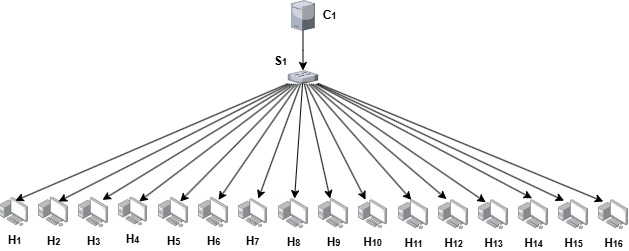
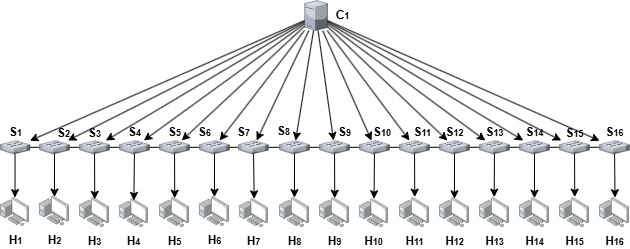
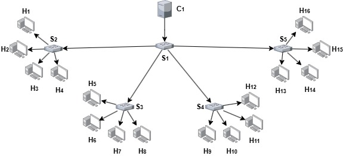
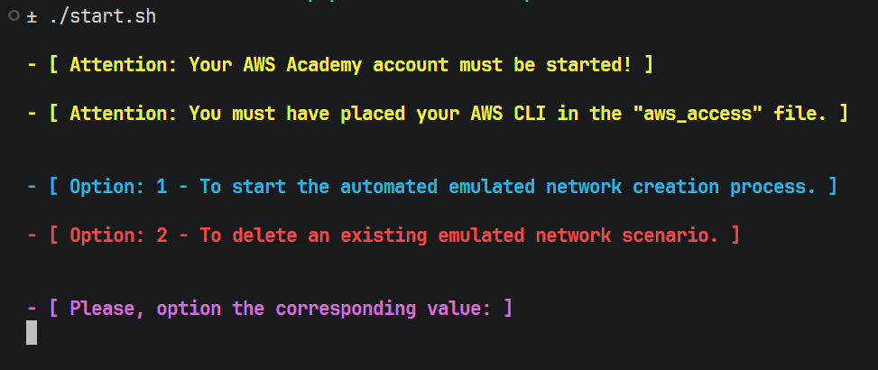
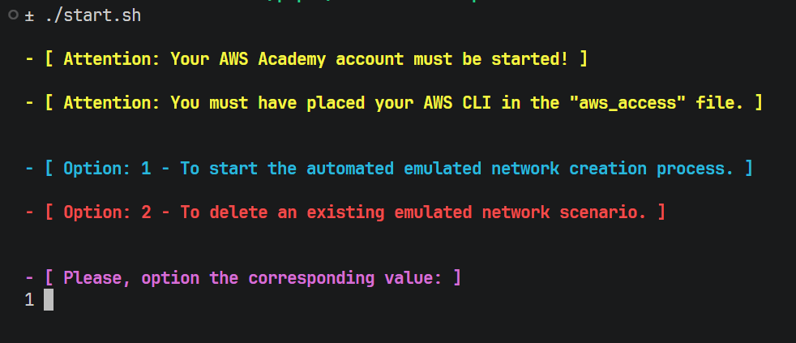
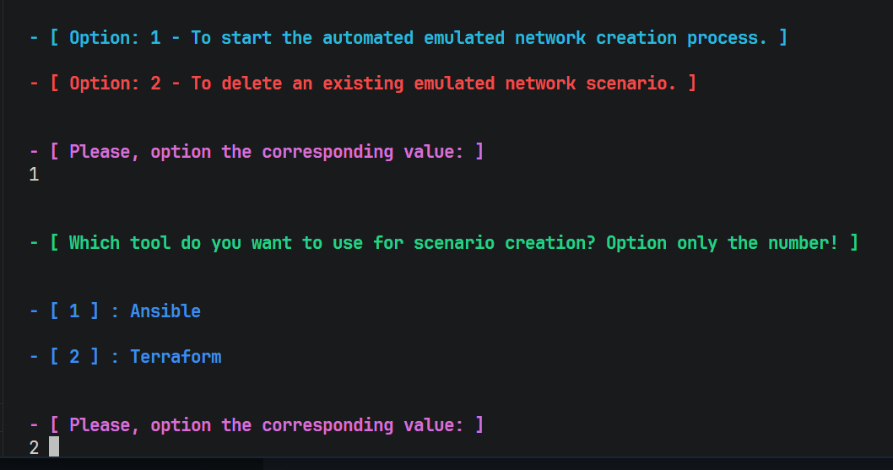
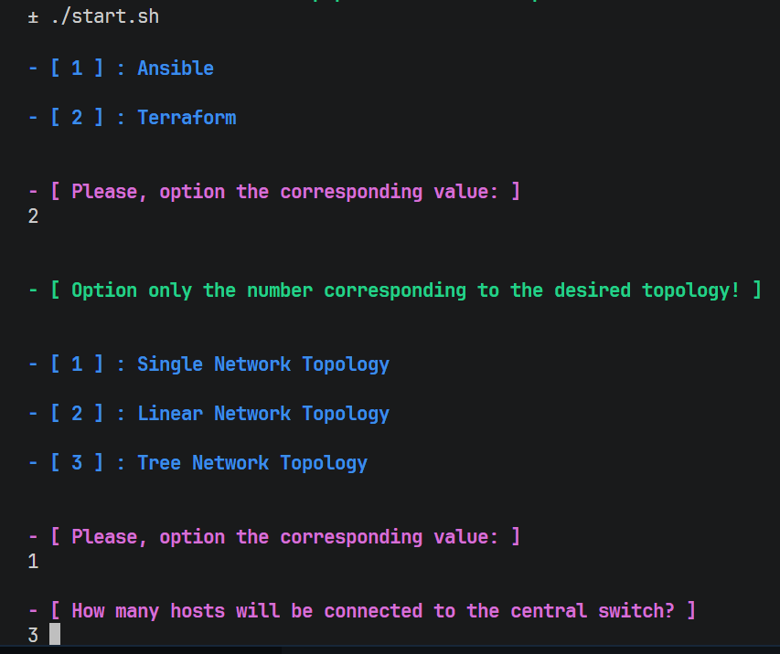
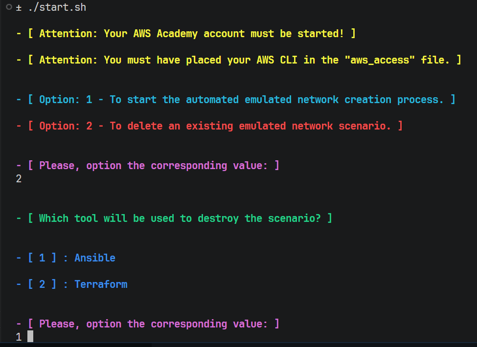

# Comparative Performance Analysis of IaC Tools for Deploying Containerized SDN Topologies in Cloud Environments

Este artefato acompanha o artigo **"Comparative Performance Analysis of IaC Tools for Deploying Containerized SDN Topologies in Cloud Environments"** (SBRC 2026), que apresenta uma análise comparativa de ferramentas de Infrastructure as Code (IaC) aplicadas à automação de topologias SDN conteinerizadas em ambientes de nuvem. O estudo avalia o desempenho em tempo de execução das ferramentas Ansible e Terraform no provisionamento e destruição de cenários de rede emulados (Single, Linear e Tree) utilizando Containernet, Docker e o controlador ONOS em instâncias AWS EC2, contribuindo com evidências empíricas e scripts reprodutíveis para apoiar a seleção de ferramentas IaC em ambientes SDN.

---

## Estrutura do README

- [Selos Considerados](#selos-considerados)
- [Informações Básicas](#informações-básicas)
- [Dependências](#dependências)
- [Preocupações com Segurança](#preocupações-com-segurança)
- [Permissões IAM Necessárias](#permissões-iam-necessárias)
- [Instalação](#instalação)
- [Teste Mínimo](#teste-mínimo)
- [Experimentos](#experimentos)
- [Material de Apoio](#material-de-apoio)
- [Dataset e Análise](#dataset-e-análise)
- [LICENSE](#license)

---

## Selos Considerados

Os selos considerados são: **Disponível (SeloD)**, **Funcional (SeloF)**, **Sustentável (SeloS)** e **Reprodutível (SeloR)**.

---

## Informações Básicas

**Ambiente de execução (máquina local):**
- Terminal: Linux (Ubuntu 22.04 recomendado)
- Permissões de: root/sudo
- Conta: AWS (Conta padrão ou programa AWS Academy)

> **Nota:** O AWS Academy é um programa disponibilizado gratuitamente por universidades de ensino superior que oferece créditos AWS para fins educacionais. Qualquer conta AWS padrão também é compatível.

**Ambiente de execução (instância EC2 provisionada automaticamente):**
- Instância AWS EC2 `t2.large` (8 GB RAM, 2 vCPUs)
- Sistema operacional: Ubuntu 22.04 (AMI `ami-007855ac798b5175e`)
- 30 GB de armazenamento (gp2)
- Docker para execução dos containers (ONOS, Containernet, hosts)
- Open vSwitch (OVS) para os switches SDN
- Controlador ONOS 2.7 exposto nas portas `6633` (OpenFlow) e `8181` (UI)

> **Nota:** Todas as configurações acima podem ser alteradas nas variáveis das ferramentas de provisionamento IaC: `automated-networks/terraform/variables.tf` (Terraform) ou `automated-networks/ansible-playbook/vars/main.yaml` (Ansible).

**Topologias suportadas:**
- **Single**: 1 switch central conectado a N hosts
- **Linear**: N switches conectados em série, cada um com 1 host
- **Tree**: topologia em árvore com 2 níveis de switches e N hosts por switch

**Topologias de exemplo:**

| Single | Linear | Tree |
|:---:|:---:|:---:|
|  |  |  |

---

## Dependências

**Máquina local:**

| Dependência | Versão testada |
|---|---|
| Terraform | >= 1.0 |
| Ansible | >= 2.16.0 |
| Python | >= 3.8 |
| boto3 | >= 1.26 |
| Jinja2 | 3.1.3 |
| urllib3 | 1.26.5 |
| community.aws (Ansible Galaxy) | >= 3.0 |

**Instância AWS EC2 (instalado automaticamente):**

| Componente | Versão |
|---|---|
| Docker | >= 24.0 |
| Open vSwitch | 2.9.8 (dentro do container Containernet) |
| ONOS | 2.7-latest |
| Containernet | latest (imagem oficial) |
| alpine-user (imagem base dos hosts) | Alpine Linux latest |

---

## Preocupações com Segurança

- As credenciais AWS (access key, secret key e, opcionalmente, session token) são lidas do arquivo `aws_access` na raiz do repositório. **Este arquivo não deve ser commitado contendo as chaves de acesso**.
- Ao utilizar o AWS Academy, as credenciais são temporárias e expiram automaticamente ao fim da sessão do laboratório.
- A chave SSH gerada pelo Terraform para acesso à instância EC2 é salva localmente em `utils/credentials/keypair.pem` e não é commitada.
- O security group criado libera as portas 22 (SSH), 8181 (ONOS UI), 6633 e 6653 (OpenFlow).

---

## Permissões IAM Necessárias

As chaves de acesso IAM utilizadas para executar o benchmark devem possuir as seguintes permissões mínimas:

| Serviço | Permissões | Finalidade |
|---|---|---|
| **EC2 – Instâncias** | `ec2:RunInstances`, `ec2:TerminateInstances`, `ec2:DescribeInstances`, `ec2:DescribeInstanceStatus`, `ec2:CreateTags`, `ec2:DeleteTags` | Criar, consultar e destruir a instância `t2.large` |
| **EC2 – Volumes** | `ec2:CreateVolume`, `ec2:DeleteVolume`, `ec2:DescribeVolumes` | Gerenciar o volume gp2 de 30 GB |
| **EC2 – Security Groups** | `ec2:CreateSecurityGroup`, `ec2:DeleteSecurityGroup`, `ec2:DescribeSecurityGroups`, `ec2:AuthorizeSecurityGroupIngress`, `ec2:RevokeSecurityGroupIngress`, `ec2:AuthorizeSecurityGroupEgress`, `ec2:RevokeSecurityGroupEgress` | Criar e configurar o security group com as portas 22, 6633, 6653 e 8181 |
| **EC2 – Key Pairs** | `ec2:CreateKeyPair`, `ec2:DeleteKeyPair`, `ec2:DescribeKeyPairs`, `ec2:ImportKeyPair` | Gerar e gerenciar o par de chaves SSH para acesso à instância |
| **EC2 – Rede/VPC** | `ec2:DescribeVpcs`, `ec2:DescribeSubnets`, `ec2:DescribeNetworkInterfaces`, `ec2:DescribeAddresses` | Consultar a VPC padrão e associar IP público |
| **EC2 – Imagens** | `ec2:DescribeImages` | Localizar a AMI Ubuntu 22.04 |

<details>
<summary><strong>Política IAM em formato JSON (clique para expandir)</strong></summary>

```json
{
  "Version": "2012-10-17",
  "Statement": [
    {
      "Sid": "EC2InstanceManagement",
      "Effect": "Allow",
      "Action": [
        "ec2:RunInstances",
        "ec2:TerminateInstances",
        "ec2:DescribeInstances",
        "ec2:DescribeInstanceStatus",
        "ec2:CreateTags",
        "ec2:DeleteTags"
      ],
      "Resource": "*"
    },
    {
      "Sid": "EC2VolumeManagement",
      "Effect": "Allow",
      "Action": [
        "ec2:CreateVolume",
        "ec2:DeleteVolume",
        "ec2:DescribeVolumes"
      ],
      "Resource": "*"
    },
    {
      "Sid": "EC2SecurityGroupManagement",
      "Effect": "Allow",
      "Action": [
        "ec2:CreateSecurityGroup",
        "ec2:DeleteSecurityGroup",
        "ec2:DescribeSecurityGroups",
        "ec2:AuthorizeSecurityGroupIngress",
        "ec2:RevokeSecurityGroupIngress",
        "ec2:AuthorizeSecurityGroupEgress",
        "ec2:RevokeSecurityGroupEgress"
      ],
      "Resource": "*"
    },
    {
      "Sid": "EC2KeyPairManagement",
      "Effect": "Allow",
      "Action": [
        "ec2:CreateKeyPair",
        "ec2:DeleteKeyPair",
        "ec2:DescribeKeyPairs",
        "ec2:ImportKeyPair"
      ],
      "Resource": "*"
    },
    {
      "Sid": "EC2NetworkReadOnly",
      "Effect": "Allow",
      "Action": [
        "ec2:DescribeVpcs",
        "ec2:DescribeSubnets",
        "ec2:DescribeNetworkInterfaces",
        "ec2:DescribeAddresses",
        "ec2:DescribeImages"
      ],
      "Resource": "*"
    }
  ]
}
```

</details>

> **Nota:** Se estiver utilizando o AWS Academy, as credenciais temporárias do Lab já possuem as permissões necessárias. A política acima é necessária apenas para contas AWS padrão.

---

## Instalação

**1.** Clone o repositório:
```sh
git clone https://github.com/vitorreiel/cloud-sdn-setup.git
cd cloud-sdn-setup
```

**2.** Obtenha suas credenciais AWS:
- **AWS Academy:** Inicie o Lab e acesse **AWS Details > AWS CLI > Show**
- **AWS padrão:** Acesse o IAM e gere um par de chaves de acesso

**3.** Copie o arquivo `aws_access.example` para o arquivo `aws_access`. Em seguida, adicione suas credenciais:
```sh
nano aws_access
```
O arquivo deve ter o formato:
```
aws_access_key_id=SUA_ACCESS_KEY
aws_secret_access_key=SUA_SECRET_KEY
aws_session_token=SEU_SESSION_TOKEN  # opcional, necessário apenas para AWS Academy
```

**4.** Execute o script principal:
```sh
./start.sh
```

> **Nota:** É durante a execução desse script que será feito a instalação automatica das dependências necessárias e ainda, guiará o processo de criação/destruição da infraestrutura via menu interativo.

---

## Teste Mínimo

Após a execução do `start.sh` você verá opções (1 ou 2) de como deseja seguir com o provisionamento.



Digite 1 e pressione enter para provisionar a infraestrutura para emulação da rede SDN, do zero.

ou

Digite 2 e pressione enter para destruir a infraestrutura de emulação que anteriormente já foi provisionada.


Para o teste mínimo, o guia abaixo recomenda o provisionamento (opção 1), com a topologia **Single** (1 switch, 3 hosts).



Digite o valor da ferramenta IaC de sua preferência e pressione enter.



Por fim, digite o valor correspondente a topologia Single (1) e digite a quantidade de hosts que irão se conectar ao switch principal (3) e finalize pressionando enter.



> **Nota:** Se for a primeira vez que você esteja executando o provisionamento, é bem capaz que nesse ponto seja solicitado que você preencha sua senha de root para confirmar o processo.

Agora, o seguinte comportamento é esperado:

**1.** Será iniciado o processo de provisionamento, no qual a instância EC2 e suas dependências são criadas e no final desse processo, o IP público é exibido pelo Ansible/Terraform no terminal.

**2.** Conecte-se à instância:
```sh
ssh -i utils/credentials/keypair.pem ubuntu@<IP_DA_INSTANCIA>
```

**3.** Verifique os containers em execução:
```sh
docker ps
```
Saída esperada: containers `onos`, `containernet` e `hosts (alpine)` em execução.

**4.** Acesse o container Containernet e observe a conectividade:
```sh
docker attach containernet
```
No CLI do Containernet, execute:
```
containernet> pingall
```
Resultado esperado: todos os hosts se comunicam (`0%` dropped).

**5.** Acesse a interface web do ONOS em `http://<IP_DA_INSTANCIA>:8181/onos/ui` (login: `onos` / senha: `rocks`) e verifique que os switches e hosts aparecem na topologia.

---

## Experimentos

### Experimento #1 — Provisionamento automatizado de topologia SDN em nuvem

A partir daqui, este repositório demonstra a criação automatizada de topologias SDN maiores e mais customizáveis.

> **Nota:** Através do script `start.sh`, é possível customizar livremente a topologia de rede seja o tipo (Single, Linear ou Tree), a quantidade de switches e hosts, ou a ferramenta IaC utilizada (Ansible ou Terraform). Para o contexto deste experimento, estamos utilizando as configurações de rede descritas abaixo.

**Passos:**

1. Execute `./start.sh` e selecione:
   - Ferramenta de IaC: `2` (Terraform) ou `1` (Ansible)
   - Topologia: `3` (Tree)
   - Switches nível 1: `1`
   - Switches nível 2: `4`
   - Hosts por switch: `5`

2. Aguarde o provisionamento. O script exibirá o IP da instância ao final.

3. Na interface do ONOS (`http://<IP>:8181/onos/ui`), verifique:
   - 5 switches conectados (S11, S21_1, S21_2, S21_3, S21_4)
   - Links entre os switches visíveis
   - Hosts descobertos após o `pingall`

4. No container Containernet, execute `pingall` e verifique a conectividade entre os 20 hosts.

**Resultado esperado:** conectividade total entre os hosts e topologia visível no ONOS.

---

### Experimento #2 — Suporte a múltiplas topologias (Single, Linear, Tree)

Execute `./start.sh` selecionando cada tipo de topologia. Após cada execução, verifique no ONOS a estrutura correspondente e execute `pingall` no Containernet para confirmar conectividade.

**Destruição do ambiente:**
```sh
./start.sh  
```

Confirme a opção 2 e a ferramenta IaC de sua preferência para destruir os cenários anteriormente criados.



Aguarde o processo de destruição.

---

## Material de Apoio

Vídeo demonstrativo com o processo de instalação e execução dos cenários:
[https://youtu.be/z7luSNC4loY](https://youtu.be/z7luSNC4loY)

---

## Dataset e Análise

Dados de análise comparativa disponíveis em: [dataset-sdn-setup](https://github.com/vitorreiel/dataset-sdn-setup.git)

---

## LICENSE

Este projeto está licenciado sob a [Apache License 2.0](LICENSE).

---


